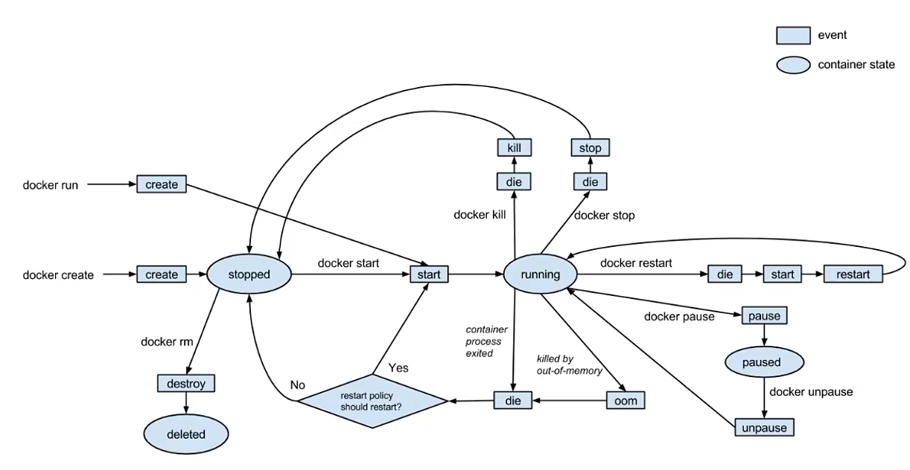

沙箱

go语言

标准的应用打包

虚拟资源


容器化**平台**


systemctl daemon-reload

systemctl restart docker


Dockerfile命令

`FROM`

```dockerfile
FROM centos
# 不依赖任何基准镜像
FROM scratch
```


`MAINTAINER`

```dockerfile
MAINTAINER 机构
LABEL 标签=value
```


`WORKDIR`设置工作目录


`ADD`&`COPY`复制文件

自动解压


`ENV`环境常量

```dockerfile
ENV JAVA_HOME /usr/local/openjdk8
```


`RUN`&`CMD`&`ENTRYPOINT`

`RUN`：镜像build时，修改镜像文件

```dockerfile
# shell格式，创建子shell进程执行，执行完销毁
RUN shell命令 # RUN ps -ef
# exec格式，创建进程替代主进程
RUN shell指令字符组 # RUN ["ps","-ef"]
```


`CMD`&`ENTRYPOINT`：容器启动时，对容器内执行命令

CMD：启动默认执行，可作为入参

ENTRYPOINT：仅执行最后一行？


```dockerfile
# 镜像基底
FROM tomcat:latest
# 机构
MAINTAINER cidea
# 工作目录
WORKDIR /usr/local/tomcat/webapps
# 添加目录下的所有文件到容器目录
ADD docker-web ./docker-web
```

EXPOSE 端口


```bash
docker build -t 机构名/镜像名[:tags] Dockerfile目录
```


netstat -tu|pn 


资源-》Docker Engine-》应用程序


docker deamon

REST API

Client docker CLI


镜像

是文件，运行程序完整的软硬件资源，应用程序的集装箱

容器

镜像的实例


宿主机，端口映射，容器

 


red hat（最小的操作系统内核）-》jdk-》tomcat


目录在/var/lib/docker


生命周期




镜像分层

按层堆叠

临时容器，系统快照，可重用`Using cache`


容器间单向通信，单向网络连接，仅限同一台宿主机 

虚拟ip，docker环境内部通信标识。创建时赋予？每次run都会变？

容器名


网桥双向通信，虚拟网络桥接

docker环境与宿主机通信

容器从网络环境分组


`Volume`数据卷


解析自动部署

```shell
docker-compose up [-d]
docker-compose down
```


云计算
基于互联网的计算方式，共享软件和硬件资源
池化思想，分时复用，按需提供

产品：阿里云；云游戏；AWS

虚拟化技术；动态可扩展；按需部署；灵活性高；可靠性高；性价比高；扩展性强

根据提供者，软件虚拟化、硬件虚拟化；
软件模拟执行客户机指令
QEMU

因特尔VT

完全虚拟化：VMWare；VitualBox；Oracle VM
半虚拟化/部分虚拟化：


一型虚拟化、二型虚拟化


操作系统虚拟化：容器技术

容器化核心技术
namespace（linux），实现资源隔离，隔离出多个轻量级的内核（docker容器）。共享宿主机资源。
操作系统提供基本要素、主机名、用户权限、文件系统、网络、进程号、进程间通信。系统调用参数、隔离内容、内核版本
基本要素，UTS：CLONE_NEWUTS，主机名称和域名
进程间通信，IPC：CLONE_NEWIPC，消息队列/共享内存/信号量
进程控制，PID：CLONE_NEWPID，进程编号
网络，NET：CLONE_NEWNET，网络设备、端口号、网络栈
文件系统，Mount：CLONE_NEWNS，挂载点、文件系统
User：CLONE_NEWUSER，用户和用户组
类似java包，mysql数据文件。

容器逃逸：


LXC（LinuX Container），linux容器管理器
`进程容器`

LXD。LXC升级版，解决进程隔离、无法跨主机迁移。容器快照概念。

CGroup，资源统计，资源限制（内存、CPU、磁盘等），分配优先级
是什么

rootfs。容器镜像。根文件系统。隔离以后执行环境。不含操作系统内核
bin、etc、dev、home、usr、root、tmp、var、sys

docker。开源的`应用容器`引擎。基于GO语言。

container。

OCI，开放容器标准

OCR，容器管理

CLI，command client interface