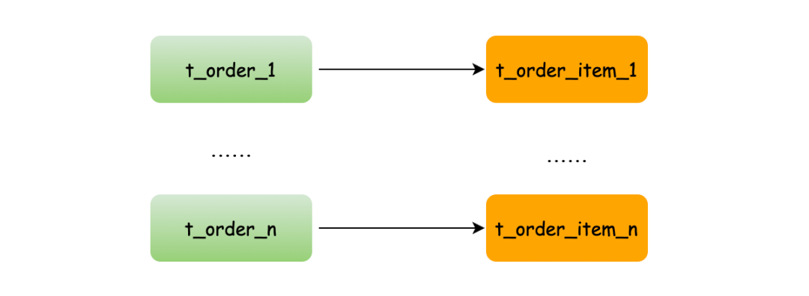

# 起因

数据库瓶颈

- 磁盘IO瓶颈，热点数据太多，数据库缓存放不下，每次查询时会产生大量的IO，降低查询速度 -> 分库和垂直分表。
- 网络IO瓶颈，请求的数据太多，网络带宽不够 -> 分库。
- CPU瓶颈
  - SQL问题，如SQL中包含[join](http://mp.weixin.qq.com/s?__biz=MzI4Njc5NjM1NQ==&mid=2247488088&idx=2&sn=501652bb26f69a11f6aca0953cbfdc50&chksm=ebd62d74dca1a4624c476ceaf04327d826c916f550a5660a287dd175034d2edb9c21b4cb4b02&scene=21#wechat_redirect)，group by，order by，非索引字段条件查询等，增加CPU运算的操作 -> SQL优化，建立合适的索引，在业务Service层进行业务计算。
  - 单表数据量太大，查询时扫描的行太多，SQL效率低，CPU率先出现瓶颈 -> 水平分表。

# 知识点

## 垂直分表

把某几列拆成一个新表，这样单行数据就会变小，B+树里的单个数据页（固定16kb）内能放入的行数就会变多，从而使单表能放入更多的数据。

## 分片（水平分表）

数据分片它将原本一张数据量较大的表 `t_order` 拆分生成数个**表结构完全一致**的小数据量表（拆分表） `t_order_0`、`t_order_1`、···、`t_order_n`，每张表只存储原大表中的一部分数据。

### 名词

#### 节点

数据节点是数据分片中一个不可再分的最小单元（表），它由数据源名称和数据表组成。

#### 逻辑表

逻辑表是指具有相同结构的水平拆分表的逻辑名称。

比如我们将订单表`t_order` 分表拆分成 `t_order_0` ··· `t_order_9`等 10 张表，这时我们的数据库中已经不存在 `t_order`这张表，取而代之的是若干的`t_order_n`表。

分库分表通常对业务代码都是无侵入式的，开发者只专注于业务逻辑 SQL 编码，我们在代码中`SQL`依然按 `t_order`来写，而在执行逻辑 SQL 前将其解析成对应的数据库真实执行的 SQL。此时 t_order 就是这些拆分表的`逻辑表`。

业务逻辑 SQL

```mysql
select * from t_order where order_no='A11111'
```

真实执行 SQL

```mysql
select * from DB_1.t_order_n where order_no='A11111'
```

#### 真实表

真实表就是在数据库中真实存在的物理表`DB_1.t_order_n`。

#### 广播表

广播表是一类特殊的表，其表结构和数据在所有分片数据源中均完全一致。与拆分表相比，广播表的数据量较小、更新频率较低，通常用于字典表或配置表等场景。由于其在所有节点上都有副本，因此可以大大降低`JOIN`关联查询的网络开销，提高查询效率。

需要注意的是，对于广播表的修改操作需要保证同步性，以确保所有节点上的数据保持一致。

**广播表的特点**：

- 在所有分片数据源中，广播表的数据完全一致。因此，对广播表的操作（如插入、更新和删除）会实时在每个分片数据源中执行一遍，以保证数据的一致性。
- 对于广播表的查询操作，仅需要在任意一个分片数据源中执行一次即可。
- 与任何其他表进行 JOIN 操作都是可行的，因为由于广播表的数据在所有节点上均一致，所以可以访问到任何一个节点上的相同数据。

订单管理系统中，往往需要查询统计某个城市地区的订单数据，这就会涉及到省份地区表`t_city`与订单流水表`DB_n`.`t_order_n`进行 JOIN 查询，因此可以考虑将省份地区表设计为`广播表`，核心理念就是**避免跨库 JOIN 操作**。

#### 单表（唯一表）

单表指所有的分片数据源中仅唯一存在的表（没有分片的表），适用于数据量不大且无需分片的表。

如果一张表的数据量预估在千万级别，且没有与其他拆分表进行关联查询的需求，建议将其设置为单表类型，存储在默认分片数据源中。


#### 分片策略

分片策略来指定使用哪种分片算法、选择哪个字段作为分片键以及如何将数据分配到不同的节点上。

分片策略是由`分片算法`和`分片健`组合而成，分片策略中可以使用多种分片算法和对多个分片键进行运算。

分库、分表的分片策略配置是相对独立的，可以各自使用不同的策略与算法，每种策略中可以是多个分片算法的组合，每个分片算法可以对多个分片健做逻辑判断。


##### 分片键

分片键决定了数据落地的位置，也就是数据将会被分配到哪个数据节点上存储。因此，分片键的选择非常重要。

比如我们将 `t_order` 表进行分片后，当插入一条订单数据执行 SQL 时，需要通过解析 SQL 语句中指定的分片键来计算数据应该落在哪个分片中。以表中`order_no`字段为例，我们可以通过对其取模运算（比如 `order_no % 2`）来得到分片编号，然后根据分片编号分配数据到对应的数据库实例（比如 `DB_1` 和 `DB_2`）。拆分表也是同理计算。

在这个过程中，`order_no` 就是 `t_order` 表的分片键。也就是说，每一条订单数据的 `order_no` 值决定了它应该存放的数据库实例和表。选择一个适合作为分片键的字段可以更好地利用水平分片带来的性能提升。

这样同一个订单的相关数据就会落在同一个数据库、表中，查询订单时同理计算，就可直接定位数据位置，大幅提升数据检索的性能，避免了全库表扫描。

> ShardingSphere？

##### 分片算法

分片算法则是用于对分片键进行运算，将数据划分到具体的数据节点中。

常用的分片算法有很多：

- **哈希分片**：根据分片键的哈希值来决定数据应该落到哪个节点上。例如，根据用户 ID 进行哈希分片，将属于同一个用户的数据分配到同一个节点上，便于后续的查询操作。
- **范围分片**：分片键值按区间范围分配到不同的节点上。例如，根据订单创建时间或者地理位置来进行分片。缺点：操作集中，容易出现`写热点`。
- **取模分片**：将分片键值对分片数取模，将结果作为数据应该分配到的节点编号。例如， order_no % 2 将订单数据分到两个节点之一。缺点：数据扩容时需要`数据迁移`。
- .....

实际业务开发中分片的逻辑要复杂的多，不同的算法适用于不同的场景和需求，也可两两结合，需要根据实际情况进行选择和调整。

#### 绑定表（副表）

绑定表是那些具有相同分片规则的一组分片表，由于分片规则一致所产生的的数据落地位置相同，在`JOIN`联合查询时能有效**避免跨库**操作。

比如：`t_order` 订单表和 `t_order_item` 订单项目表，都以 `order_no` 字段作为分片键，并且使用 `order_no` 进行关联，因此两张表互为绑定表关系。

> 使用绑定表进行多表关联查询时，必须使用分片键进行关联，否则会出现笛卡尔积关联或跨库关联，从而影响查询效率。

当使用 `t_order` 和 `t_order_item` 表进行多表联合查询，执行如下联合查询的逻辑 SQL。

```
SELECT * FROM t_order o JOIN t_order_item i ON o.order_no=i.order_no
```

如果不配置绑定表关系，两个表的数据位置不确定就会全库表查询，出现笛卡尔积关联查询，将产生如下四条`SQL`。

```
SELECT * FROM t_order_0 o JOIN t_order_item_0 i ON o.order_no=i.order_no
SELECT * FROM t_order_0 o JOIN t_order_item_1 i ON o.order_no=i.order_no
SELECT * FROM t_order_1 o JOIN t_order_item_0 i ON o.order_no=i.order_no
SELECT * FROM t_order_1 o JOIN t_order_item_1 i ON o.order_no=i.order_no
```


而配置绑定表关系后再进行关联查询时，分片规则一致产生的数据就会落到同一个库表中，那么只需在当前库中 `t_order_n` 和 `t_order_item_n` 表关联即可。

```mysql
SELECT * FROM t_order_0 o JOIN t_order_item_0 i ON o.order_id=i.order_id
SELECT * FROM t_order_1 o JOIN t_order_item_1 i ON o.order_id=i.order_id
```



> **注意**：在关联查询时 `t_order` 它作为整个联合查询的主表。所有相关的路由计算都只使用主表的策略，`t_order_item` 表的分片相关的计算也会使用 `t_order`的条件，所以要保证绑定表之间的分片键要完全相同。

### 流程

分库分表后在应用层面执行一条 SQL 语句时，通常需要经过以下六个步骤：`SQL 解析`-> `执⾏器优化` -> `SQL 路由` -> `SQL 改写` -> `SQL 执⾏` -> `结果归并` 。


#### SQL解析

**SQL解析过程**分为`词法解析`和`语法解析`两步。

比如下边查询用户订单的 SQL，先用词法解析将这条 SQL 拆解成不可再分的原子单元。在根据不同数据库方言所提供的字典，将这些单元归类为关键字，表达式，变量或者操作符等类型。

```
SELECT order_no FROM t_order where  order_status > 0  and user_id = 10086
```

接着语法解析会将拆分后的 SQL 关键字转换为抽象语法树，通过对抽象语法树遍历，提炼出分片所需的上下文，上下文包含查询字段信息（`Field`）、表信息（`Table`）、查询条件（`Condition`）、排序信息（`Order By`）、分组信息（`Group By`）以及分页信息（`Limit`）等，并标记出 SQL 中有可能需要改写的位置。

#### 查询优化

根据 SQL 查询特点和执行统计信息，选择最优的查询计划并执行，比如`user_id`字段有索引，那么会调整两个查询条件的位置，主要是提高 SQL 的执行效率。

#### SQL路由

通过上边的 SQL 解析得到了分片上下文数据，在匹配用户配置的分片策略和算法，就可以运算生成路由路径，将 SQL 语句路由到相应的数据节点上。

简单点理解就是拿到分片策略中配置的分片键等信息，在从 SQL 解析结果中找到对应分片键字段的值，计算出 SQL 该在哪个库的哪个表中执行，SQL 路由又根据有无分片健分为 `分片路由` 和 `广播路由`。


##### 标准路由

单`分片键`，不包含关联查询或仅包含绑定表之间关联查询的 SQL。是最推荐也是最为常⽤的分⽚⽅式。

当 SQL `分片键`的运算符为 `=` 时，路由结果将落⼊单库（表），当分⽚运算符是`BETWEEN` 或`IN` 等范围时，路由结果则不⼀定落⼊唯⼀的库（表），因此⼀条逻辑 SQL 最终可能被拆分为多条⽤于执⾏的真实 SQL。

##### 直接路由

> TODO：没看懂

直接路由是直接将 SQL 路由到指定⾄库、表的一种分⽚方式，而且直接路由可以⽤于分⽚键不在 SQL 中的场景，还可以执⾏包括⼦查询、⾃定义函数等复杂情况的任意 SQL。

##### 笛卡尔积路由

联表查询时，`分片键`不同，导致各表的数据分散在不同`节点`中，需要用各表的每个`节点`笛卡尔积查询结果。查询性能较低，尽量避免走此路由模式。

比如订单表`t_order` 分片键是`t_order_id`和用户表`t_user`分片键是`t_order_id`，`t_oder`有两个节点，t_user也有两个节点，那路由就是2*2四个。

```mysql
SELECT * FROM t_order_0 t LEFT JOIN t_user_0 u ON u.user_id = t.user_id WHERE t.user_id = 1;
SELECT * FROM t_order_0 t LEFT JOIN t_user_1 u ON u.user_id = t.user_id WHERE t.user_id = 1;
SELECT * FROM t_order_1 t LEFT JOIN t_user_0 u ON u.user_id = t.user_id WHERE t.user_id = 1;
SELECT * FROM t_order_1 t LEFT JOIN t_user_1 u ON u.user_id = t.user_id WHERE t.user_id = 1;
```

##### 全库表路由

全库表路由针对的是数据库 `DQL`和 `DML`，以及 `DDL`等操作，当我们执行一条逻辑表 `t_order` SQL 时，在所有分片库中对应的真实表 `t_order_0` ··· `t_order_n` 内逐一执行。

##### 全库路由

全库路由主要是对数据库层面的操作，比如数据库 `SET` 类型的数据库管理命令，以及 TCL 这样的事务控制语句。

对逻辑库设置 `autocommit` 属性后，所有对应的真实库中都执行该命令。

```java
SET autocommit=0;
```

##### 全实例路由

全实例路由是针对数据库实例的 DCL 操作（设置或更改数据库用户或角色权限），比如：创建一个用户 order ，这个命令将在所有的真实库实例中执行，以此确保 order 用户可以正常访问每一个数据库实例。

```mysql
CREATE USER order@127.0.0.1 identified BY '程序员小富';
```

##### 单播路由

单播路由用来获取某一真实表信息，比如获得表的描述信息：

```
DESCRIBE t_order;
```

`t_order` 的真实表是 `t_order_0` ···· `t_order_n`，他们的描述结构相完全同，我们只需在任意的真实表执行一次就可以。

##### 阻断路由

⽤来屏蔽 SQL 对数据库的操作，例如：

```
USE order_db;
```

这个命令不会在真实数据库中执⾏，因为 `ShardingSphere` 采⽤的是逻辑 Schema（数据库的组织和结构） ⽅式，所以无需将切换数据库的命令发送⾄真实数据库中。

#### SQL改写

SQL 经过解析、优化、路由后已经明确分片具体的落地执行的位置，接着就要将基于逻辑表开发的 SQL 改写成可以在真实数据库中可以正确执行的语句。比如查询 `t_order` 订单表，我们实际开发中 SQL 是按逻辑表 `t_order` 写的。

```mysql
SELECT * FROM t_order;
```

这时需要将分表配置中的逻辑表名称改写为路由之后所获取的真实表名称。

```mysql
SELECT * FROM t_order_n;
```

#### SQL执行

将路由和改写后的真实 SQL 安全且高效发送到底层数据源执行。但这个过程并不能将 SQL 一股脑的通过 JDBC 直接发送至数据源执行，需平衡数据源连接创建以及内存占用所产生的消耗，它会自动化的平衡资源控制与执行效率。

#### 结果归并

将从各个数据节点获取的多数据结果集，合并成一个大的结果集并正确的返回至请求客户端，称为结果归并。而我们 SQL 中的排序、分组、分页和聚合等语法，均是在归并后的结果集上进行操作的。

# 工具

- sharding-sphere：jar，前身是sharding-jdbc；
- TDDL：jar，Taobao Distribute Data Layer；
- Mycat：中间件。

# 问答

读扩散，很多情况下，查询并不依靠分片键，于是就会对所有分表都执行。

根据查询列做新的分片索引表，从查询列映射到分片键上，再用分片键去查。其实就是`倒排索引`。

> 感觉成本很高啊，列那么多，还要考虑复合查询

> 将mysql接入es也非常简单，我们可以通过开源工具 `canal` 监听mysql的`binlog`日志变更，再将数据解析后写入es，这样es就能提供**近实时**的查询能力。

> **tidb**，是个**分布式数据库**。
>
> 它通过引入**Range**的概念进行数据表分片
>
> 它支持普通索引，并且普通索引也是分片的
>
> 并且tidb跟mysql的语法几乎一致，现在也有非常多现成的工具可以帮你把数据从mysql迁移到tidb。所以开发成本并不高。

# 参考

文献

[分库分表的 21 条法则](https://mp.weixin.qq.com/s/szRFyo8wF46U53GKQuxiMw)

[如果让你去设计淘宝那么多订单的的系统，你怎么分库分表？](https://mp.weixin.qq.com/s/J_zVlrR9cDX9Vrg6YVjUiA)

[MySQL：互联网公司常用分库分表方案汇总](https://mp.weixin.qq.com/s/HRIaCTvDnfxR3G3zWmEvUw)

TODO [实战 2000w 数据大表的优化过程，提供三种解决方案](https://cloud.tencent.com/developer/article/2277229)

案例

https://github.com/littlecharacter4s/study-sharding
